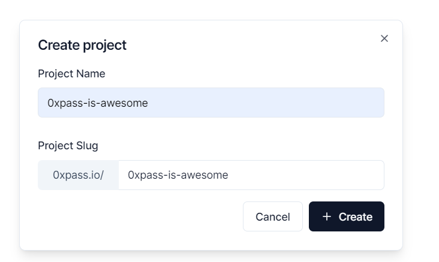
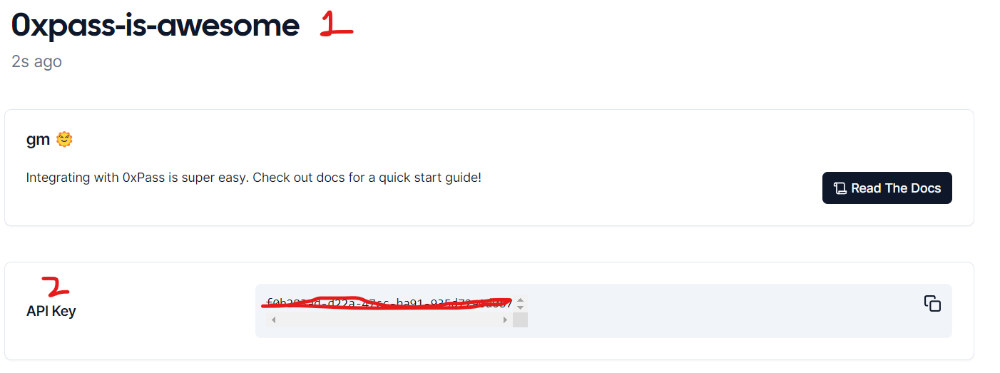
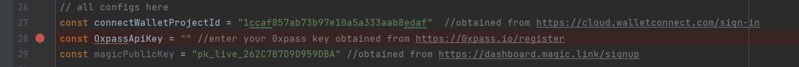

# Getting Started with Create Next App

This project was bootstrapped with Create Next App

## Install the project

In the project directory, you can run:


```bash
pnpm install
```


or

```bash
yarn install
```

or


```bash
npm install --force
```


## Signup on 0xpass

Signup on [0xpass Dashboard](https://dashboard.0xpass.io/)

## Create a new project




## Extract API Keys

Once you are inside project, copy 0xpass API Keys(2)



## Replace 0xpass apiKey in _app.tsx
Line 23



## Start the app

```bash
pnpm dev
```

**OR**

```bash
yarn dev
```

**OR**

```bash
npm dev
```

